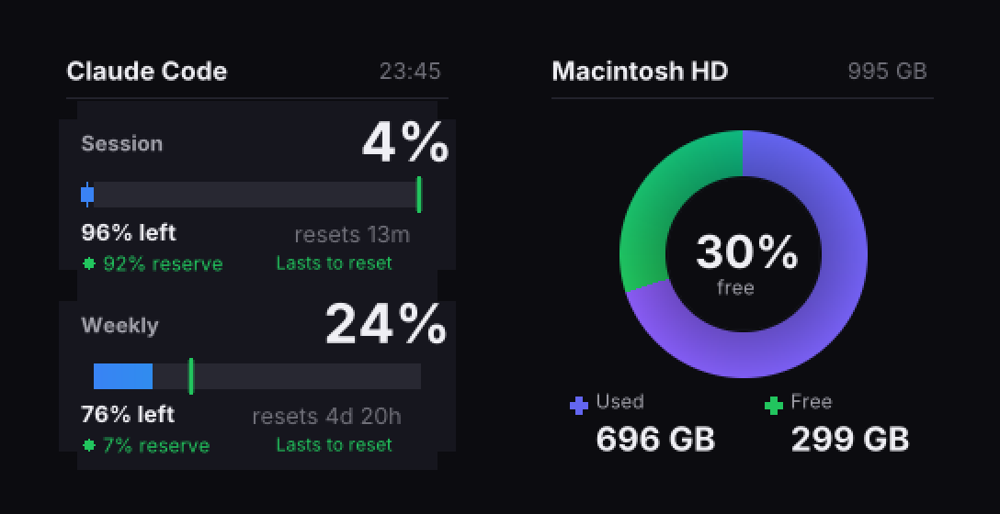
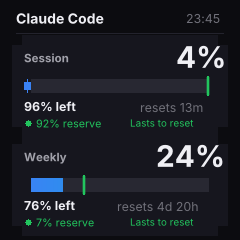
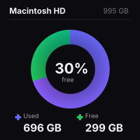

# geekmagic-stats

Push live Claude Code usage stats and macOS disk space to a [GeekMagic SmallTV](https://geekmagic.cc) display over your local network.



The device auto-cycles between screens every 10 seconds in album mode.

## Screens

### Claude Code Usage



- **Session** (5-hour) and **Weekly** (7-day) usage windows
- Gradient progress bars with pace markers showing expected vs actual usage
- Pace indicator: whether your current rate lasts to reset, or an ETA when it runs out
- Reset countdown and remaining percentage
- Local timestamp

### Disk Usage



- Anti-aliased donut chart with gradient coloring
- Free space percentage in the center
- Used/free breakdown in GB

## Requirements

- **GeekMagic SmallTV Ultra** (240x240, tested on firmware Ultra-V9.0.43)
- **[claude-code-stats](https://crates.io/crates/claude-code-stats)** crate (used as an in-process Rust library)
- Rust toolchain

## Install

```sh
cargo install --path .
```

This installs two binaries to `~/.cargo/bin/`:
- `geekmagic-stats` — stats screen (+ optional disk)
- `geekmagic-disk` — disk screen standalone

## Usage

### One-shot push

```sh
# Push stats screen only (uses host from config)
geekmagic-stats

# Push stats + disk as auto-cycling album
geekmagic-stats --with-disk

# Custom device IP
geekmagic-stats --host 192.168.1.50 --with-disk

# Save to file instead of pushing
geekmagic-stats --output preview.png
```

### Configuration

By default, config is read from `~/.config/geekmagic-stats/config.toml`.

```toml
host = "10.0.1.102"
daemon = 300
with_disk = true
```

`host` is required for uploads unless you only use `--output`.

You can override the path with `--config /path/to/config.toml`.

Precedence order:
- CLI flags
- config file
- built-in defaults (`with_disk = false`, no default daemon)

`geekmagic-disk` supports the same config file and `--config` flag.

### Daemon mode

Push updated screens every 5 minutes:

```sh
geekmagic-stats -d 300 --with-disk
```

The interval (in seconds) has a minimum of 10s to avoid flooding the device.

### Run on startup (macOS)

Create `~/Library/LaunchAgents/com.geekmagic.stats.plist`:

```xml
<?xml version="1.0" encoding="UTF-8"?>
<!DOCTYPE plist PUBLIC "-//Apple//DTD PLIST 1.0//EN" "http://www.apple.com/DTDs/PropertyList-1.0.dtd">
<plist version="1.0">
<dict>
    <key>Label</key>
    <string>com.geekmagic.stats</string>
    <key>ProgramArguments</key>
    <array>
        <string>/Users/YOU/.cargo/bin/geekmagic-stats</string>
        <string>--config</string>
        <string>/Users/YOU/.config/geekmagic-stats/config.toml</string>
    </array>
    <key>KeepAlive</key>
    <true/>
    <key>StandardOutPath</key>
    <string>/tmp/geekmagic-stats.log</string>
    <key>StandardErrorPath</key>
    <string>/tmp/geekmagic-stats.log</string>
</dict>
</plist>
```

Then load it:

```sh
launchctl load ~/Library/LaunchAgents/com.geekmagic.stats.plist
```

Manage:

```sh
# View logs
tail -f /tmp/geekmagic-stats.log

# Stop (auto-restarts due to KeepAlive)
launchctl stop com.geekmagic.stats

# Disable completely
launchctl unload ~/Library/LaunchAgents/com.geekmagic.stats.plist

# Restart after rebuilding
cargo install --path . && launchctl kickstart -k gui/$(id -u)/com.geekmagic.stats
```

## How it works

1. Uses the `claude-code-stats` crate to collect current API usage as JSON
2. Computes pace locally (rate of usage vs time remaining) if not provided by the API
3. Renders 240x240 dark-themed images using `image` + `imageproc` + `ab_glyph` with the Inter font
4. Encodes to JPEG and uploads via multipart POST to the device's HTTP API
5. Sets album mode with autoplay so the device cycles between screens

The device runs a plain HTTP server with no authentication. Images are uploaded to `/doUpload?dir=/image/` and displayed by setting theme 3 (Photo Album).

## Project structure

```
src/
  config.rs      Loads config from ~/.config/geekmagic-stats/config.toml
  main.rs        CLI entry point, daemon loop
  stats.rs       Calls claude-code-stats crate, parses JSON, computes pace
  render.rs      Renders the stats screen (progress bars, text)
  disk.rs        Standalone disk usage binary
  disk_render.rs Renders the disk donut chart
  upload.rs      JPEG encoding, device upload, album management
  lib.rs         Shared library (upload + disk_render)
fonts/
  Inter-Regular.ttf
  Inter-Bold.ttf
```

## Device compatibility

Built for the GeekMagic SmallTV Ultra (240x240 LCD). The device firmware has some HTTP quirks (duplicate `Content-Length` headers, data after `Connection: close`) which are handled gracefully.

Should work with other GeekMagic models that support the same HTTP API and Photo Album theme — the SmallTV Pro uses theme 4 instead of 3 and has a 128x128 display.
